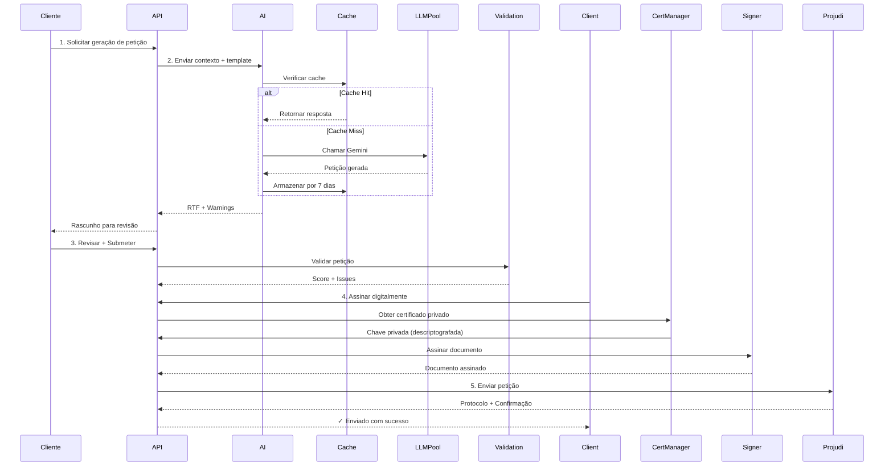

# Assinatura Digital + Geração de Petições com IA

Fluxo completo: Gerar petição com IA → Validar → Assinar digitalmente → Enviar para Projudi.

## 🔄 Fluxo End-to-End



## 1️⃣ Gerar Petição com IA

### Requisição

```bash
curl -X POST http://localhost:3000/api/v1/ai/generate-petition \
  -H "Authorization: Bearer <token>" \
  -H "Content-Type: application/json" \
  -d '{
    "processNumber": "0000001-12.2023.8.26.0100",
    "petitionType": "intermediate",
    "context": {
      "plaintiff": "João Silva",
      "defendant": "Maria Santos",
      "subject": "Cobrança de débito contratual",
      "relief": [
        "Condenação ao pagamento de R$ 50.000,00",
        "Correção monetária desde a data do fato"
      ],
      "arguments": [
        "Contrato de prestação de serviços vigente",
        "Mora comprovada por recibos"
      ],
      "caseHistory": "Processo anterior teve sentença condenatória transitada em julgado"
    }
  }'
```

### Resposta

```json
{
  "status": "success",
  "petitionId": "pet-123",
  "plainText": "PETIÇÃO INTERMEDIÁRIA\n\n...",
  "rtfContent": "{\\rtf1\\ansi...",
  "confidence": 0.87,
  "provider": "gemini",
  "cached": false,
  "warnings": [
    "⚠️ Verifique todas as referências de artigos em fontes oficiais",
    "⚠️ Consulte STF/TJ para verificar citações de jurisprudência"
  ],
  "suggestedEdits": [
    "Esclareça melhor o pedido principal",
    "Use conexões lógicas mais claras"
  ],
  "estimatedReadTime": "5 minutos"
}
```

## 2️⃣ Revisar e Validar

### Validação Automática

```bash
curl -X POST http://localhost:3000/api/v1/ai/validate-petition \
  -H "Authorization: Bearer <token>" \
  -H "Content-Type: application/json" \
  -d '{
    "petitionId": "pet-123",
    "petitionType": "intermediate"
  }'
```

### Resposta da Validação

```json
{
  "status": "success",
  "isValid": true,
  "score": 94,
  "issues": [],
  "warnings": [
    "Jurisprudência não foi verificada em STF/TJ",
    "Considere adicionar citação recente de jurisprudência"
  ],
  "suggestions": [
    "Fortaleça a argumentação com precedentes similares",
    "Especifique melhor o tipo de procedimento recomendado"
  ],
  "nextStep": "ready_to_sign"
}
```

### Cenários de Rejeição

| Score | Status | Ação |
|-------|--------|------|
| < 60 | ❌ Inválida | Reescrever completamente |
| 60-75 | ⚠️ Parcial | Fazer edições sugeridas |
| 75-90 | ⚠️ Boa | Apenas revisão humana |
| 90+ | ✅ Excelente | Pronto para assinatura |

## 3️⃣ Assinar Digitalmente

### Upload do Certificado (Primeira Vez)

```bash
curl -X POST http://localhost:3000/api/v1/auth/certificate/upload \
  -H "Authorization: Bearer <token>" \
  -F "file=@certificado.pfx" \
  -F "password=senha_certificado"
```

### Assinar Petição

```bash
curl -X POST http://localhost:3000/api/v1/petitions/{petitionId}/sign \
  -H "Authorization: Bearer <token>" \
  -H "Content-Type: application/json" \
  -d '{
    "certificateFingerprint": "a1b2c3d4e5f6...",
    "certificatePassword": "senha_certificado",
    "timestamp": true
  }'
```

### Resposta

```json
{
  "status": "success",
  "petitionId": "pet-123",
  "signed": true,
  "signatureDetails": {
    "certificateSubject": "CN=João Silva, O=OAB, C=BR",
    "signedAt": "2024-01-15T10:30:00Z",
    "signatureHash": "abc123def456...",
    "timestampAuthority": "http://timestamp.server.com"
  },
  "nextStep": "ready_to_submit"
}
```

## 4️⃣ Enviar para Projudi

### Submit Petição Assinada

```bash
curl -X POST http://localhost:3000/api/v1/projudi/petitions \
  -H "Authorization: Bearer <token>" \
  -H "Content-Type: multipart/form-data" \
  -F "petitionId=pet-123" \
  -F "processNumber=0000001-12.2023.8.26.0100" \
  -F "documentType=PETICAO" \
  -F "attachments=@anexo1.pdf" \
  -F "attachments=@anexo2.pdf"
```

### Resposta do Projudi

```json
{
  "status": "success",
  "protocol": {
    "protocolNumber": "2024011500001",
    "protocolDate": "2024-01-15T10:35:00Z",
    "processNumber": "0000001-12.2023.8.26.0100",
    "status": "Aguardando processamento",
    "message": "Petição recebida com sucesso"
  },
  "petitionId": "pet-123",
  "signedAt": "2024-01-15T10:30:00Z",
  "submittedAt": "2024-01-15T10:35:00Z"
}
```

---

## 🛠️ Implementação Prática

### Serviço de Assinatura

```typescript
// src/services/signatureService.ts

class SignatureService {
  async signPetition(
    petitionContent: string,
    certificateFingerprint: string,
    password: string,
  ): Promise<SignedDocument> {
    // 1. Obter certificado descriptografado
    const certificate = await certificateManager.getCertificateForSigning(
      certificateFingerprint,
      password,
    );

    // 2. Converter para formato PDF/A-3 para assinatura
    const pdfContent = await this.convertToPDF(petitionContent);

    // 3. Assinar com node-forge
    const signature = this.createDigitalSignature(pdfContent, certificate);

    // 4. Adicionar timestamp
    const timestamp = await this.getTimestamp();

    // 5. Retornar documento assinado
    return {
      content: this.embedSignature(pdfContent, signature, timestamp),
      signatureHash: signature.hash,
      signedAt: new Date(),
      certificateSubject: certificate.subject,
    };
  }

  private createDigitalSignature(
    content: Buffer,
    privateKey: forge.pki.PrivateKey,
  ): { hash: string; signature: string } {
    const md = forge.md.sha256.create();
    md.update(content.toString());

    const signature = privateKey.sign(md);
    return {
      hash: md.digest().toHex(),
      signature: forge.util.encode64(signature),
    };
  }

  private async getTimestamp(): Promise<string> {
    // Chamar TSA (Time Stamp Authority)
    const response = await axios.post('https://timestamp.server.com/time', {
      data: 'petition',
    });
    return response.data.timestamp;
  }

  private embedSignature(
    pdfContent: Buffer,
    signature: any,
    timestamp: string,
  ): Buffer {
    // Embutir assinatura digital no PDF usando IText/PDFBox
    // Este é pseudocódigo - seria implementado com biblioteca PDF real
    const pdfWithSignature = Buffer.from(
      pdfContent.toString('utf-8') +
      `\n\n[ASSINADO DIGITALMENTE]\nHash: ${signature.hash}\nData: ${timestamp}`,
    );
    return pdfWithSignature;
  }
}

export const signatureService = new SignatureService();
```

### Controller da API

```typescript
// src/api/controllers/petitionController.ts

router.post('/petitions/:id/sign', async (req, res) => {
  const { certificateFingerprint, certificatePassword, timestamp } = req.body;
  const petitionId = req.params.id;

  try {
    // 1. Obter petição do banco
    const petition = await Petition.findById(petitionId);
    if (!petition) {
      return res.status(404).json({ error: 'Petição não encontrada' });
    }

    // 2. Validar se está pronta para assinatura
    if (petition.status !== 'draft' && petition.status !== 'validated') {
      return res.status(400).json({
        error: 'Petição deve estar em rascunho para ser assinada',
      });
    }

    // 3. Assinar
    const signed = await signatureService.signPetition(
      petition.content,
      certificateFingerprint,
      certificatePassword,
    );

    // 4. Atualizar status
    petition.status = 'signed';
    petition.signedAt = signed.signedAt;
    petition.signatureHash = signed.signatureHash;
    await petition.save();

    // 5. Registrar audit log
    await auditLog.create({
      userId: req.user.id,
      action: 'petition_signed',
      petitionId,
      certificateFingerprint,
      timestamp: new Date(),
    });

    res.json({
      status: 'success',
      petitionId,
      signed: true,
      signatureDetails: {
        certificateSubject: signed.certificateSubject,
        signedAt: signed.signedAt,
        signatureHash: signed.signatureHash,
      },
    });
  } catch (error) {
    logger.error({ err: error }, 'Erro ao assinar petição');
    res.status(500).json({ error: 'Erro ao assinar petição' });
  }
});
```

## 📊 Fluxo de Contingência

### Se a IA Falhar

```typescript
// LLMPool tenta automaticamente:
1. Gemini 3.5 Flash (timeout 30s)
2. Grok 4.1 Fast (timeout 30s)
3. Ollama local (timeout 60s)
4. Template offline (sempre funciona)
```

### Se o Certificado Expirar

```typescript
const isValid = await certificateManager.isValidCertificate(cert);
if (!isValid) {
  throw new CertificateError('Certificado expirado. Por favor, renovar.');
  // Cliente é notificado para fazer upload de novo certificado
}
```

### Se Projudi Cair

```typescript
// Petição é armazenada como "pending_submission"
// Sistema tenta reenviar a cada:
- 1 minuto (primeiras 10 tentativas)
- 5 minutos (próximas 10 tentativas)
- 1 hora (máximo 24 horas)
```

## 💰 Custo Estimado por Petição

| Operação | Provedor | Custo |
|----------|----------|-------|
| Gerar (1000 tokens) | Gemini | $0.05 |
| Cache hit | Cache | $0.00 |
| Validar | Gemini | $0.02 |
| Assinatura | Local | $0.00 |
| **Total** | | **$0.07** |

**Com 100 petições/mês:** ~$7 de IA

## ✅ Checklist de Compliance

- [ ] Petição sempre revisada por humano antes de envio
- [ ] Assinatura digital com certificado OAB válido
- [ ] Audit log completo de quem assinou quando
- [ ] Timestamp verificado em TSA
- [ ] Nenhuma decisão automática (apenas geração/sugestão)
- [ ] LGPD: dados sensíveis nunca saem do servidor
- [ ] Certificado armazenado encriptado (AES-256)

## 🚀 Deploy em Produção

```bash
# 1. Setup Ollama (fallback local)
ollama pull initium/law_model

# 2. Configurar chaves de API
export GEMINI_API_KEY="sua_chave"
export GROK_API_KEY="sua_chave"  # Opcional

# 3. Iniciar servidor
docker-compose up -d

# 4. Verificar saúde
curl http://localhost:3000/health
curl http://localhost:3000/api/v1/ai/status
```

## 📚 Referências

- [node-forge Documentation](https://github.com/digitalbazaar/forge)
- [PDF Signature Standards](https://en.wikipedia.org/wiki/Signature_file#PDF_signatures)
- [RFC 3161 - Timestamp Protocol](https://tools.ietf.org/html/rfc3161)
- [ICP-Brasil Requisitos](https://www.gov.br/cidadania/pt-br/acesso-a-informacao/acoes-e-programas/infraestrutura-de-chaves-publicas)
